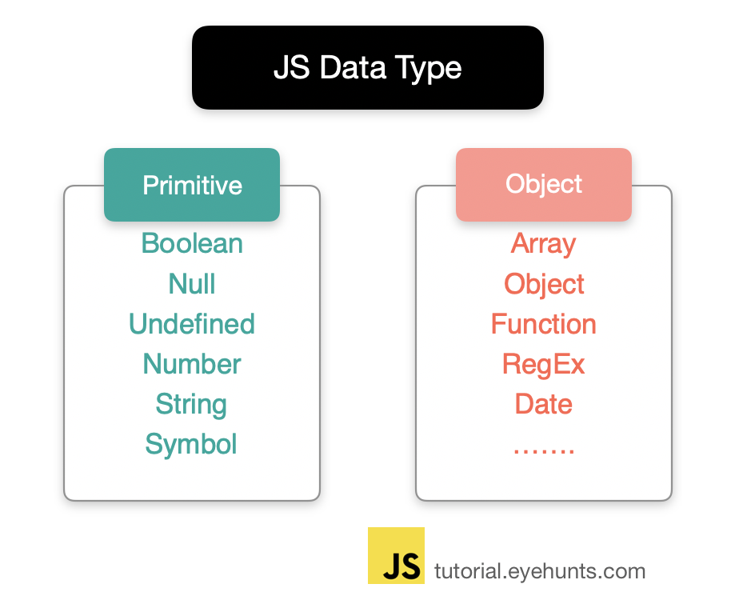

# Immutable value vs mutable value
---
## Data Type
---


- Javascript의 **Primitive type은 변경 불가능한 값(Immutable Value)이다**

- 즉, 원시 타입 이외의 모든 값은 객체 타입이며
- **객체 타입은 변경 가능한 값이다**
- 객체는 새로운 값을 다시 만들 필요없이 직접 변경할 수 있다는 것이다.

<br>

## 예제1
---
```js
var statement = "string is an immutable value";

var otherStr = statement.slice(13, 22);

console.log(statement); // string is an immutble value
console.log(otherStr); // immutable
```

- 문자열을 변경할 수 없는 immutable value
- 그래서 slice 함수는 statement 변수에 저장된 문자열을 변경하지 않고
- 새로운 문자열을 생성해서 반환한다.

<br>

## 예제2
---
```js
var v1 = [];
console.log(v1.length); // 0

var v2 = v1.push(2);
console.log(v1.length); // 1
```
- 배열을 객체이고 객체는 mutable value이다
- 그래서 slice 함수와는 다르게 push는 직접 대상 배열을 변경한다.

<br>

## 예제3
---
```js
var user = {
  name: 'Lee',
  address: {
    city: 'Seoul'
  }
};

var myName = user.name; // 변수 myName은 string 타입이다.

user.name = 'Kim';
console.log(myName); // Lee

myName = user.name;  // 재할당
console.log(myName); // Kim
```
- myName에 user.name의 참조가 할당되는 것이 아니다
- 메모리에 새로 할당한 immutable한 값 'Lee'를 참조한다
- 그래서 user.name에 'Kim'을 새로 할당하더라도 myName의 값은 'Lee'이다

<br>

## 예제4
---
```js
var user1 = {
  name: 'Lee',
  address: {
    city: 'Seoul'
  }
};

var user2 = user1; // 변수 user2는 객체 타입이다.

user2.name = 'Jang';

console.log(user1.name); // Jang
console.log(user2.name); // Jang
```
- user1과 user2가 같은 객체를 참조하고 있다
- user2.name을 'Jang'으로 바꾸면 객체는 변경가능하므로 원본값이 변경된다
    - user2.name은 string이기 때문에 immutable하다
    - 따라서 user2.name에는 메모리에 새로 할당한 'Jang'이라는 값을 참조한다 
- 결과적으로 user1의 name도 변경되게 된다

<br>
