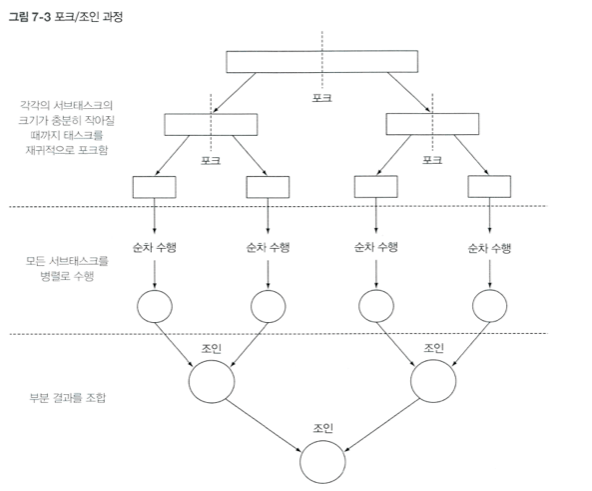
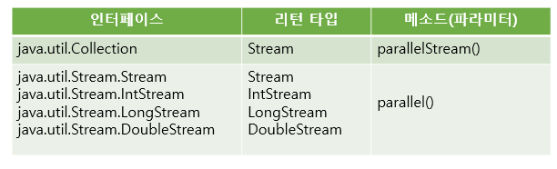
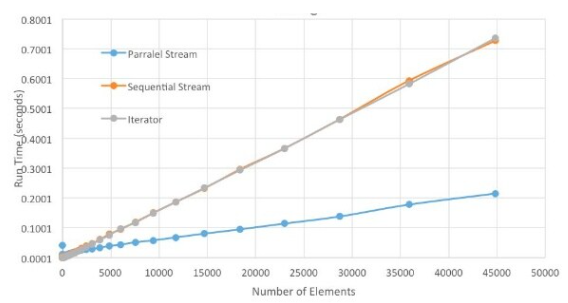

# ForkJoin Framework
---
## 포크조인 프레임워크
---
- 병렬 스트림은 요소들을 병렬 처리하기 위해 포크조인 프레임워크 사용
- 포크 단계에서는 전체 데이터를 서브 데이터로 분리
- 각각의 코어에서 작업을 병렬로 수행
- 조인 단계에서는 서브 결과를 합해서 최종 결과를 만듬

  

 

- ExecutorService의 구현 객체인 ForkJoinPool을 사용
  - 내부적으로 서브요소를 나누는 알고리즘 사용
  - 각각의 코어에서 스레드 관리 필요
  - ExecutorService의 구현 객체인 ForkJoinPool 사용해서 작업 스레드를 관리
    - 얼만큼을 포크할지 개발자가 설정할 수도 있고, 시스템에 맡길 수 있다
    - 시스템이 최적화된 알고리즘을 통해 적절히 배분

 

## 병렬 스트림 생성 메소드
---
- 병렬 스트림을 사용하는 경우, 포크조인 프레임워크가 백그라운드에서 사용되기 때문에 쉽게 병렬 처리 가능

  

- 병렬 스트림 처리 과정
  - 스레드를 만들고 초기화한다
  - 데이터를 여러 개의 청크로 분리한다
  - 각 스레드에 청크를 할당하고 계산
  - 각 스레드의 결과를 하나로 병합

 

## 병렬 스트림 성능
---
- 하드웨어, element 특성 등에 따라 Sequential Stream의 성능이 더 나을 수도 있으므로 테스트를 해보는 것이 필요하다

   
   출처 - https://www.slideshare.net/devsejong/3-stream-api-advance 