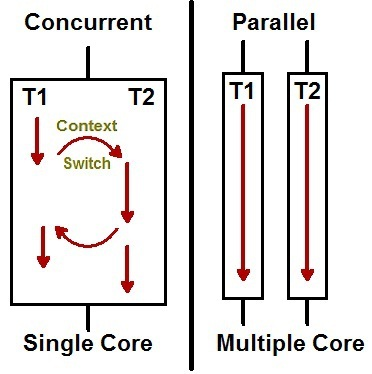

# 병행 프로그래밍
---
## Concurrent Task
---
- Runnable 인터페이스에 실행할 태스크를 작성
- run 메소드의 코드는 thread 안에서 실행
```java
public interface Runnable {
    void run();
}
```
- 이는 비효율적인 방식
  - 스레드와 태스크를 일대일로 할당하는 것은 바람직하지 않음
  - 자주 사용되지 않는데도 스레드 하나를 만들어야 한다는 것 자체가 비효율적

<br>

- **Executor 클래스**
  - 태스크과 스레드를 내부적으로 사용하는 알고리즘을 통해 적절히 매칭
  ```java
  Executor exec = Executors.newCachedThreadPool();
  Runnable task = ...;
  exec.execute(task);
  ```

<br>

- 결과를 반환해야 할 때 -> Callable 인터페이스
  - Runnable 인터페이스의 run 메소드와 달리 결과를 반환
  ```java
  public interface Callable<V> {
      V call() throws Exception;
  }
  ```
  - Callable 사용하려면  Executor의 서브인터페이스인 ExecutorService 사용
  ```java
  ExcutorService exec = Executors.newCachedThreadPool();
  Callable<V> task = ...;
  Future<V> result = exec.submit(task);
  ```
    - future 객체의 get() 메소드를 통해 결과 값을 얻게 되거나 타임아웃에 이를 때까지 block


<br>

## Parallel Operation
---
- 병렬 처리?
  - 물리적인 코어에서 각 코어가 병렬적으로 처리하는 것
  - 작업 처리 시간을 줄이기 위한 것이 목적
  - 자바8 부터 병렬 처리를 할 수 있도록 병렬 스트림을 제공 (포크-조인 프레임워크)
  - 컬렉션의 전체 요소 처리 시간을 줄여 줌

<br>

## Concurrency(동시성) vs Parallelism(병렬성)
---
- **동시성**은 멀티 작업을 위해 **멀티 스레드가 번갈아 가면서 실행**

- **병렬성**은 멀티 작업을 위해 **멀티 코어를 이용해서 동시에 실행**

    

<br>
