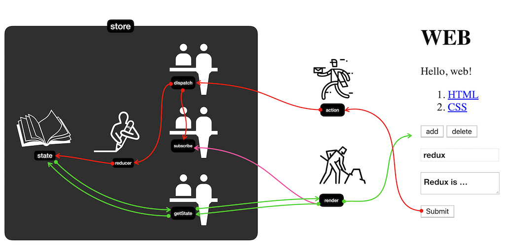

# Redux 여행의 지도
---

(출처 : https://opentutorials.org/module/4078/24935)

- render 함수를 store의 subscribe에 등록 -> state 바뀔 때 마다 UI가 변경
    ```js
    store.subscribe(render);
    ```
- 사용자가 submit 클릭 
- action이 dispatch로 전달
- render 함수 호출
    - state 변경
    - subscribe에 등록된 render 함수 확인
- render에서 getState 호출
- state 기반으로 UI 업데이트