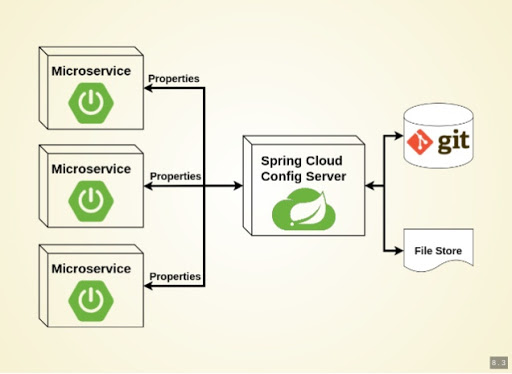

# Spring Cloud Config
---
- MSA 아키텍처에서 설정 파일을 외부화하여 관리
- 외부화 하기 위해서 대표적으로 사용하는 기술
- Spring Cloud Config를 사용하여 설정을 외부화하였을 때 장점
    - 운영중에 서버 빌드 및 배포를 다시 할 필요 없이 환경 설정을 변경할 수 있다
    - 환경에 따라 달라지는 설정 정보를 소스와 분리하여 유지보수 용이성이 높아진다

 

## 구성 요소
---
- Spring Cloud Config Server
    - Git과 같은 툴로 백업되어 어플리케이션 설정 파일을 관리
- Spring Cloud Config Client
    - Config Server에 접근할 수 있도록 도와줌

    

- MSA 서비스들이 Spring Cloud Config Client를 통해 Spring Cloud Config Server와 통신
- Spring Cloud Config Server는 Git에서 설정 파일을 가져옴

 

